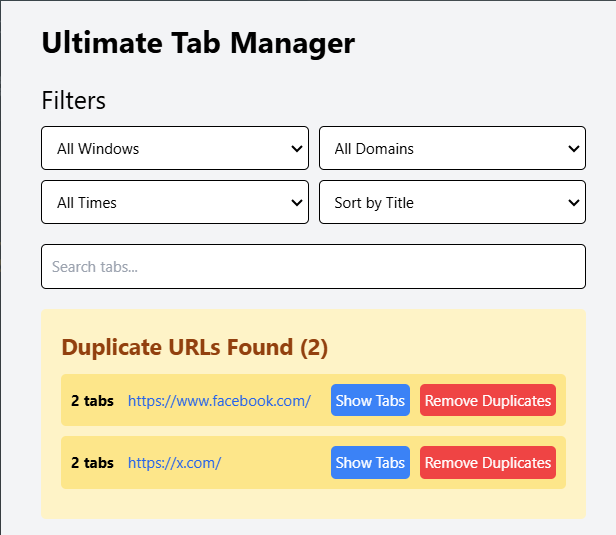
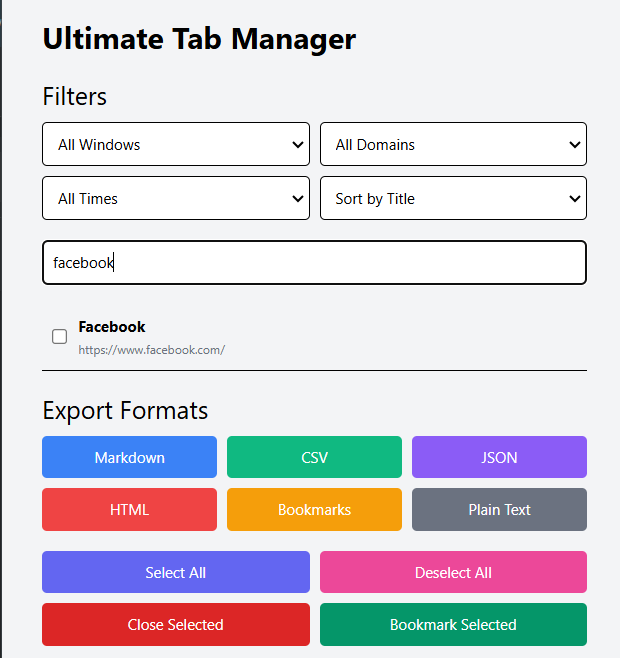

# Tabs Manager Extension

## Description

A browser extension to manage your tabs efficiently. It allows you to search, bookmark, close, and download tabs in various formats.

## Features

- Searching over your tabs in no-time
- selecting tabs to (close/bookmark/download) in many formats
- automatic detection of duplicate tabs

## Installation

Instructions on how to install and set up the Tabs Manager Extension.

1. Clone the repository:

   ```bash
   git clone https://github.com/mrbomber0x001/tabs-manager-extension.git
   ```

2. Navigate to the project directory:

   ```bash
   cd tabs-manager-extension
   ```

3. Open Chrome and navigate to `chrome://extensions/`.

4. Enable "Developer mode" by toggling the switch in the top right corner.

5. Click on "Load unpacked" and select the `tabs-manager-extension` directory.

## Usage

How to use the Tabs Manager Extension after installation.

1. Click on the extension icon in the Chrome toolbar.
2. Use the provided options to search, bookmark, close, or download tabs.

### Screenshots

Automatic detection of duplicated tabs



Searching over tabs



## Contributing

Guidelines for contributing to the Tabs Manager Extension.

1. Fork the repository.
2. Create a new branch (`git checkout -b feature-branch`).
3. Make your changes.
4. Commit your changes (`git commit -m 'Add some feature'`).
5. Push to the branch (`git push origin feature-branch`).
6. Open a pull request.
